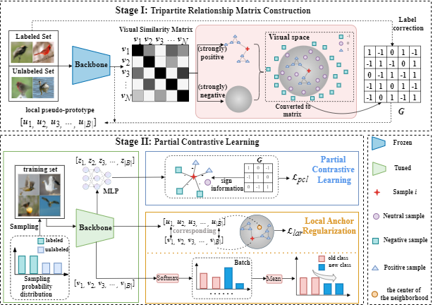

<div align="center">
  <h1> Tripartite Relationship Modeling for 
Enhanced Generalized Category Discovery </h1>
</div>

<div align="center">
  <h3>Yuwei Bian, Shidong Wang, 
Chunming Li, Haofeng Zhang, Ling Shao </h3>
</div>

<!-- <p align="center">
  
</p> -->

## Environmnet installation
This project is built upon the following environment:
* [Python 3.7](https://pytorch.org)
* [PyTorch 1.13.1 + cu117](https://pytorch.org)

The package requirements can be installed via `requirements.txt`, 
```bash
pip install -r requirements.txt
```

## Datasets
We use fine-grained benchmarks in this paper, including:
* [The Semantic Shift Benchmark (SSB)](https://github.com/sgvaze/osr_closed_set_all_you_need#ssb) and [Herbarium19](https://www.kaggle.com/c/herbarium-2019-fgvc6)

We also use generic object recognition datasets, including:
* [CIFAR10](https://pytorch.org/vision/stable/datasets.html), [CIFAR100](https://pytorch.org/vision/stable/datasets.html) and [ImageNet-100](https://image-net.org/download.php)

Please follow [this repo](https://github.com/sgvaze/generalized-category-discovery) to set up the data.

Download the datasets, and pretrained model by following the file structure below and set `DATASET_ROOT={YOUR DIRECTORY}` in `config.py`.

## Training
the backbone obtained from SimGCD
```bash
bash scripts/run_{DATASET}.sh
```
or
```bash
python train.py --dataset_name 'cub' 
```

### Experimental results on GCD task.

<table>
  <tr>
    <td> </td>
    <td>All</td>
    <td>Old</td>
    <td>Novel</td>
  </tr>
  <tr>
    <td>CIFAR10</td>
    <td align="center">97.3</td>
    <td align="center">96.9</td>
    <td align="center">97.5</td>
</tr>
  <tr>
    <td>CIFAR100</td>
    <td align="center">84.5</td>
    <td align="center">83.7</td>
    <td align="center">86.1</td>
</tr>
  <tr>
    <td>ImageNet100</td>
    <td align="center">86.6</td>
    <td align="center">94.5</td>
    <td align="center">82.6</td>
 </tr>
  <tr>
    <td>CUB</td>
    <td align="center">69.0</td>
    <td align="center">73.3</td>
    <td align="center">66.9</td>
 </tr>
  <tr>
    <td>Stanford Cars</td>
    <td align="center">59.2</td>
    <td align="center">73.1</td>
    <td align="center">52.4</td>
 </tr>

  <tr>
    <td>Herbarium19</td>
    <td align="center">48.4</td>
    <td align="center">58.7</td>
    <td align="center">42.9</td>
</tr>
</table>
